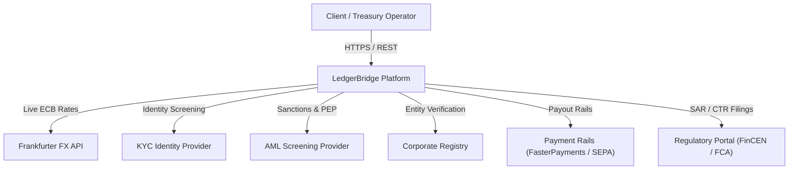
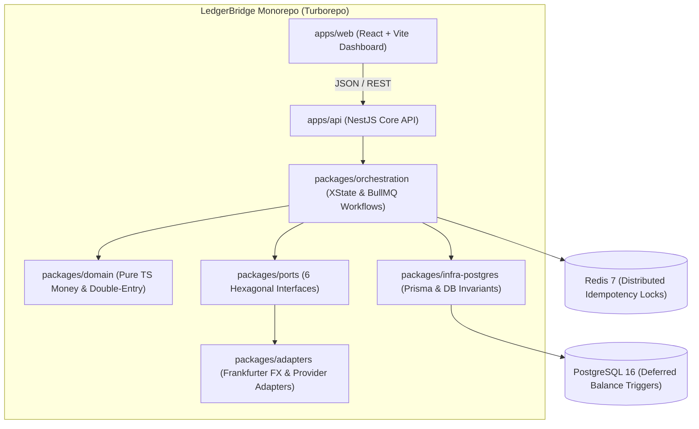
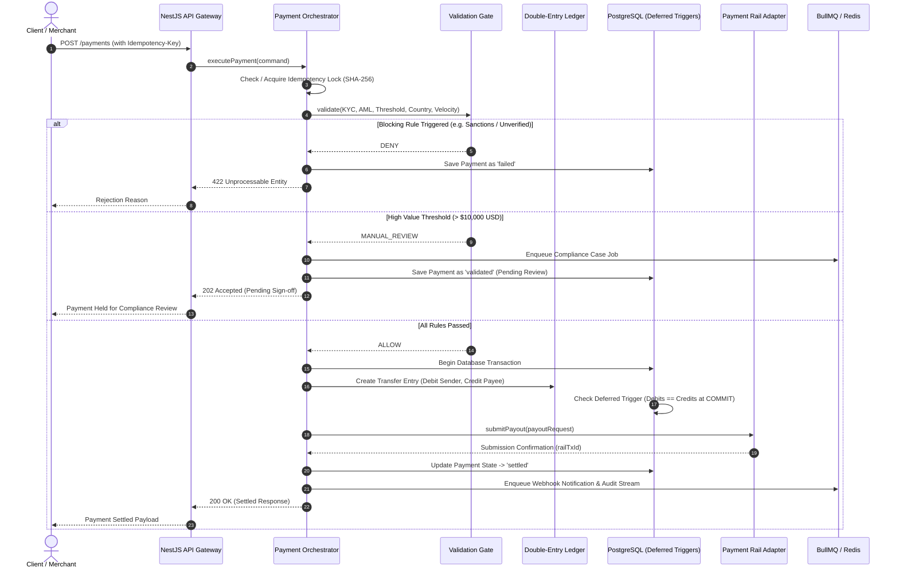

# LedgerBridge: Enterprise Fintech & Double-Entry Payment Platform

LedgerBridge is an institutional-grade fintech and payment management platform engineered with **Domain-Driven Design (DDD)**, **Double-Entry Accounting**, **PostgreSQL Deferred Invariant Triggers**, **Distributed Idempotency & BullMQ Queuing**, **6 Hexagonal Port Integrations (including live Frankfurter FX)**, **XState Payment State Machine**, **NestJS Modular API with Zod & RBAC**, **OpenTelemetry/Prometheus/Grafana Observability**, and a **Modern Fintech Dashboard**.

---

## 🏛️ System Architecture & C4 Model

### C4 Level 1: System Context


### C4 Level 2: Containers & Monorepo Boundaries


---

## 💳 Payment Flow Sequence Diagram



---

## 📐 Double-Entry Accounting Invariants

Every financial movement within LedgerBridge conforms to the fundamental accounting equation:

$$\text{Assets} = \text{Liabilities} + \text{Equity}$$

And for every journal entry $E$:

$$\sum_{p \in E} \text{Debits}(p) - \sum_{p \in E} \text{Credits}(p) \equiv 0$$

### PostgreSQL Deferred Trigger (`infra/postgres/triggers/01_ledger_balance_trigger.sql`)
```sql
CREATE CONSTRAINT TRIGGER trg_enforce_ledger_balance
AFTER INSERT OR UPDATE OR DELETE ON postings
DEFERRABLE INITIALLY DEFERRED
FOR EACH ROW
EXECUTE FUNCTION verify_ledger_entry_balance();
```

---

## ⚙️ Monorepo Package Structure

| Package / App | Purpose |
| :--- | :--- |
| `apps/api` | NestJS REST API with Zod validation, Keycloak/RBAC, OpenTelemetry, Prometheus metrics |
| `apps/web` | Modern React + Vite Fintech Dashboard with live FX calculator & T-account explorer |
| `packages/domain` | Pure TypeScript domain: `Money` (`bigint`), `LedgerAccount`, `Posting`, `Rule<T>`, `AuditRecord` |
| `packages/ports` | 6 Hexagonal Interfaces: `KycProvider`, `AmlProvider`, `CompanyVerificationProvider`, `FxProvider`, `PaymentRailProvider`, `RegulatoryProvider` |
| `packages/adapters` | Concrete implementations (Live Frankfurter FX, Mock sandboxes, HMAC SHA256 webhook verification) |
| `packages/infra-postgres` | Prisma ORM models, clean repositories, and SQL trigger migration definitions |
| `packages/orchestration` | XState payment state machine, Redis idempotency service, BullMQ queue workers |
| `packages/shared` | Zod DTO schemas, Error codes, security contexts, common interfaces |

---

## 🚀 Quick Start & Development

### 1. Prerequisites
- **Node.js**: >= 20.x (tested on v26.4.0)
- **npm**: >= 10.x

### 2. Installation
```bash
npm install
```

### 3. Run Automated Tests (120+ Tests)
```bash
npm test
```

### 4. Run Development Servers
```bash
npm run dev
```
- **Web Dashboard**: `http://localhost:3000`
- **Backend API**: `http://localhost:3001`
- **Prometheus Metrics**: `http://localhost:3001/admin/metrics`
- **Health Check**: `http://localhost:3001/admin/health`

### 5. Docker Infrastructure Setup
To start PostgreSQL 16, Redis 7, Keycloak, Prometheus, Grafana, and Jaeger with one command:
```bash
cd infra/docker
docker compose up -d
```

---

## 🔒 Security & RBAC Enforcement

| Role | Permissions |
| :--- | :--- |
| `admin` | Full system control, account creation, database seeding, telemetry access |
| `compliance_officer` | Review manual cases, approve/reject high-value (> $10k) and AML flagged payments |
| `auditor` | Read-only inspection of immutable cryptographic audit stream and ledger journals |
| `operator` | Create payments, view balances, check rail submission status |
| `customer` | Initiate standard transfers, request FX quotes, view owned account balances |

---

## 🛡️ Failure Mode & Recovery Analysis

1. **Network Partitions during Rail Submission**: If a network timeout occurs while contacting the external payment rail, the idempotency lock transitions to `PROCESSING` with automatic expiration, preventing double debiting while allowing safe exponential backoff retries.
2. **Database Imbalance Abort**: Any software defect attempting to commit an unbalanced ledger entry is immediately rejected by the PostgreSQL deferred constraint trigger before commit.
3. **Audit Log Tampering**: The PostgreSQL immutability trigger unconditionally raises an exception on any SQL `UPDATE` or `DELETE` attempt on `audit_logs`.
